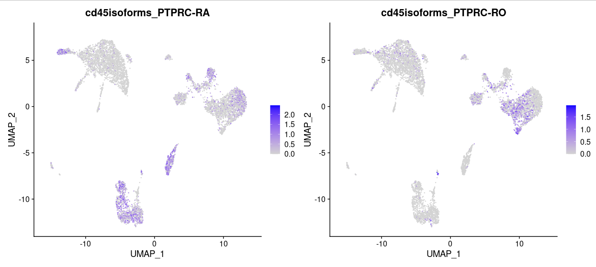

-[//]--[//]--[//]--[//]--[//]--[//]--[//]--[//]--[//]--[//]--[//]--[//]--[//]--[//]--[//]--[//]-  
/]--[//]--[//]--[//]--[//]--[//]--[//]--[//]--[//]--[//]--[//]--[//]--[//]--[//]--[//]--[//]--[/  

                       _______  _____    _______  _______  _____
                      [__   __]|  __ \  |  _____][__   __]/  ___\
                         | |   | |  \ \ | |         | |   | |
                         | |   | |   | \| |___      | |   \ \__
                         | |   | |   | ||  ___]     | |    \__ \
                         | |   | |   | /| |         | |       \ \
                       __| |__ | |__/ / | |_____  __| |__ ____| |
                      [_______]|_____/  |_______][_______]\_____/


-[//]--[//]--[//]--[//]--[//]--[//]--[//]--[//]--[//]--[//]--[//]--[//]--[//]--[//]--[//]--[//]-  
/]--[//]--[//]--[//]--[//]--[//]--[//]--[//]--[//]--[//]--[//]--[//]--[//]--[//]--[//]--[//]--[/  


## About IDEIS

This script runs a pipeline that identifies CD45 or PTPRC isoforms in 10X single cell data processed by Cell Ranger beforehand. 
The software uses a list of exons, a list of  rules and the length of reads used for mapping to build a list of customized and optimized transcripts, to which then reads from CD45/PTPRC locus are mapped using salmon alevin. 
The quantification then tells us which isoforms are present in which cells. 
Main purpose is to identify CD45RA and CD45RO isoforms in Homo Sapiens from 5' sequencing, but it also works in Mus Musculus and for exons B and C. 
However, due to the location of key exons in CD45/PTPRC the usage is extremely limited in 3' sequencing.

## Getting IDEIS

To obtain the copy of this software simply clone this repository in your current directory using the following command:

```
git clone https://github.com/Lab-of-Adaptive-Immunity/IDEIS
```

Some modes of software will require 10X Cell Ranger whitelists to be present in 'IDEIS/cr_whitelists' subdirectory, specifically files named '3M-february-2018.txt' and '737K-august-2016.txt'.
You can find them in your installation of 10X Cell Ranger at 'cellranger-x.y.z/cellranger-cs/x.y.z/lib/python/cellranger/barcodes' (for versions 3 and earlier) or
at 'cellranger-x.y.z/lib/python/cellranger/barcodes/' (for later versions), but you can also download them here:

```
cd cr_whitelists
wget https://github.com/Lab-of-Adaptive-Immunity/cr_whitelists/raw/main/737K-august-2016.txt
wget https://github.com/Lab-of-Adaptive-Immunity/cr_whitelists/raw/main/3M-february-2018.txt.gz
gunzip 3M-february-2018.txt.gz
cd ..
```

Finally, you can download an example data set to run file on, but it is not required; you may want to skip directly to the analysis of your own data.

```

```

## Requirements

To run software correctly you need to have following packages installed

* python3.7 or higher (tested on version 3.8.10)
  * python packages os, sys, glob, gzip, pathlib, argparse, inspect, shutil and subprocess
* salmon alevin 1.9
* samtools
* R with Rscript

We provide a way to create conda environment with these packages installed. The 'Conda' directory provides a file 'conda_IDEIS_env_specifications.txt' that specifies complete environment needed to run IDEIS. If you don't have Conda, install it according to instructions here: <https://conda.io/projects/conda/en/latest/user-guide/install/index.html>. 
Then, create and activate Conda environment for IDEIS:

```
conda create --name IDEIS_env --file Conda/conda_IDEIS_env_specifications.txt
conda activate IDEIS_env
```

Once the environment is ready and activated, you can clone IDEIS using the command specified in "Getting IDEIS" section if not done. 
Lastly, you need to obtain the software bamtofastq-1.4.1. You can get it on this page <https://github.com/10XGenomics/bamtofastq/releases/tag/v1.4.1>. 
In case of LINUX systems you can use the following command when in cloned IDEIS directory:

```
cd IDEIS
wget https://github.com/10XGenomics/bamtofastq/releases/download/v1.4.1/bamtofastq_linux
mv bamtofastq_linux bamtofastq-1.4.1
```

You might also need to make bamtofastq executable, which can be done this way:

```
chmod ugo+x bamtofastq-1.4.1
```

Now you should have all that is needed to run IDEIS.

### Non-standard dependencies installations

If you have already installed dependency software but don't have set paths to it or wish to use their locally installed versions, you can modify 'config.txt' file located directly in IDEIS directory.
Simply uncomment (remove '#') from line where path to desired software is and replace /path/to/software with your absolute path.

## Running IDEIS

### Simple user cases

The simplest user case that should cover the absolute majority of desired analyses is investigation of PTPRC isoforms in human and murine data. 
We provide the built-in references for these cases. The first run of data will automatically perform indexing for Salmon software and other required tasks, which will be then reused in next runs. 
As such, the only thing needed to run the command in simplast cases is, assuming the current directory is still IDEIS:

```
python IDEIS_main.py Reference_Dir analyzed_bam.bam Results dir -g Species --whitelist Whitelist_file.csv
```

where:

* Reference_Dir is directory where the software will save all reference-related files such as Salmon indices. These are created if they don't exist; if they do, they are simply reused.
* analyzed_bam.bam is path to BAM file generated by 10X Cell Ranger analysis that one wants to analyze for PTPRC isoforms;
* Results is the path to directory containing results (more detailed descripton below)
* Species (-g option or also --species) is a species that is analyzed; this software has three options corresponding to simple user cases, and these are GRCm38 (mouse, default version), BALBcj and Homo-Sapiens.
* Whitelist_file (--whitelist option) specifies the path to list of cells that should be analyzed. Optional.

Note that BAM file must be indexed and its index must be located in the same directory as BAM; if you lack it, you can generate using samtools:

```
samtools index your_bam
```

Whitelist_file.csv used with --whitelist option is not mandatory but recommended, especially when analysis is done in R with Seurat, as using this parameter creates an .rds object that can be added to Seurat object as an assay. If you don;t have the file but you have your data loaded in R as Seurat object named seu.obj, you can simply export the whitelist as.

```
write(gsub('-1','', colnames(seu.obj)), 'Whitelist_file.csv')
```

An alternative is to provide whole seurat object as .rds file. In that case the command to run IDEIS software would be:

```
python IDEIS_main.py Reference_Dir analyzed_bam.bam Results dir -g Species --data-set Seurat_object.rds
```

Where --data-set parameter specifies the path to seruat object. You can generate that in R from Seurat object stored in variable seu.obj using the command:

```
saveRDS(seu.obj, 'Seurat_object.rds')
```

Remember that in case of either whitelists or seurat object the command used in IDEIS needs to specify *whole* path to them.

Once analysis is done, the Result directory will then look like:

* Fastqs(.fastq generated from .bam)  
* Results(results containing following subdirectories):
* * alevin (alevin output)  
* * Iso_counts (raw matrix in)  
* * Datasets (if --data-set was provided; contains data set with extra assay)  
* * whitelist.csv (if --data-set was provided; contains list of cells used in provided data set)  

If --whitelist option was used, then the directory Results/Iso_counts will contain file 'raw_matrix.rds' with only specified cells. 
If --data-set option was provided, Results/Datasets will contain a file 'dataset_with_cd45.rds' that will contain original seurat object with new assay storing CD45 counts in it. 
These are the files that are critical for analysis, the rest of files are just files used for computation and/or debugging.

### Using IDEIS --whitelist or --data-set option

There is also possibility to not provide --whitelist nor --data-set option. In such case the command to run IDEIS will be reduced to:

```
python IDEIS_main.py Reference_Dir analyzed_bam.bam Results dir -g Species
```

and the file 'raw_matrix.rds' in directory Results/Iso_counts will contain all standard barcodes instead. 
The disadvantage to this approach is longer running time due to generation of bigger matrix as well as the need to subset of matrix before adding it to Seurat object once imported in R.

### Using custom reference

In some cases, such as when the result was mapped to reference that is not supported by one of default options, one needs to create their own files before the run as well as specify some supplementary options.
There are two main things one needs:

* FASTA file with exons relevant to Ptprc analysis;
* Set of rules to indicate how exons in transcripts are chained.

FASTA file should list all relevant exon. Here's an example of FASTA used for mouse reference GRCm38:

```
\>Ptprc-R R
TTTGTTCTTAGGGTAAGAGAGTAGGAAACTTGCTCCCCATCTGATAAGACAGAGTGCAAA
GGAGACCCTATTTCTTAGGGGCACAGCTGATCTCCAGATATGACCATGGGTTTGTGGCTC
AAACTTCTGGCCTTTGGATTTGCCCTTCTGGACACAGAAGTCTTTGTCACAG
GGCAAACACCTACACCCAGTGATG

\>Ptprc-A A
AACTGAGCACAACAGAGAATGCCCTTCTTCTGCCTCAAAGTGACCCCTTACCTGCTCGCA
CCACTGAATCCACACCCCCAAGCATCTCTGAAAGAGGAAATGGCTCTTCAGAGACCACAT
ATCATCCAG

\>Ptprc-B B
GTGTGTTATCCACGCTGCTGCCTCACCTGTCCCCACAGCCTGACTCGCAGACGCCCTCTG
CCGGAGGAGCTGACACTCAGACATTCAGCAGCCAAGCTGACAATCCCACACTCACGCCTG
CTCCCGGCGGCGGGACTGACCCACCAG

\>Ptprc-C C
GTGTGCCAGGGGAGAGGACTGTACCGGGGACCATTCCTGCAGACACAGCCTTTCCTGTTG
ATACCCCCAGCCTTGCACGCAACAGCTCTGCTGCCTCACCTACACACACCTCCAATGTCA
GCACCACAGATATCTCTTCAG

\>Ptprc-O O
GTGCCAGCCTCACAACTCTTACACCATCCACTCTGGGCCTTGCAAGCACTGACCCTCCAA
GCACAACCATAG
CTACCACAACGAAGCAAACATGTG
CTGCCATGTTTGGGAACATTACTGTGAATTACACCTATGAATCTAGTAATCAGACTTTTA
AGGCAGACCTCAAAGATGTCCAAAATGCTAAGTGTGGAAATGAGGATTGTGAAAACGTGT
TAAATAATCTAGAAGAATGCTCACAGATAAAAAACATCAGTGTGTCTAATGACTCATGTG
CTCCAGCTACAACTATAGATTTATATGTACCACCAG
```

Each exon is introduced as separate FASTA entry in multi-FASTA file. Each header has two values: the full name and the short notation. The latter is used in transcript rules.

The file with transcript rules specifies how exons identifying transcripts specific to given isoform look like. For mouse reference GRCm38 it looks like this:

```
A:R,A,B,C,O:Ptprc-RABCO-1:Ptprc-RA
A:R,A,B,O:Ptprc-RABO-2:Ptprc-RA
A:R,A,C,O:Ptprc-RACO-3:Ptprc-RA
A:R,A,O:Ptprc-RAO-4:Ptprc-RA
B:R,A,B,C,O:Ptprc-RABCO-5:Ptprc-RB
B:R,A,B,O:Ptprc-RABO-6:Ptprc-RB
B:R,B,C,O:Ptprc-RBCO-7:Ptprc-RB
B:R,B,O:Ptprc-RBO-8:Ptprc-RB
C:R,A,B,C,O:Ptprc-RABCO-9:Ptprc-RC
C:R,B,C,O:Ptprc-RBCO-10:Ptprc-RC
C:R,A,C,O:Ptprc-RACO-11:Ptprc-RC
C:R,C,O:Ptprc-RCO-12:Ptprc-RC
:R,-,O:Ptprc-RO-13:Ptprc-RO
```

The important fields are separated by ':' and the their significance is as follows:

* First field indicates the exon of interest for this transcript. In case of transcript identifying isoforms carrying exon A, it will be A. 
If it is junction-specific, such as isoform PTPRC-RO (where we are interested in junction between R and O specifically), it has no central exon of interest, so in that case the field is left blank.
* Second field shows how the exons in specific transcripts are linked. The list of exons is ordered as the exons follow one after another, separated by ','. 
* Third field shows the name of transcript as used by Salmon
* Last field shows the name of gene as used by Salmon as well as downstream files used for generation of .rds files or count matrices, so it is important to keep these names if one intends to use those.

The reason why the exon of interest is given in separate, here first, field, is that the software optimizes transcript for length of reads generated from sequencing. 
This is done by constructing transcript from full sequence of exons and adding flanks to it that are build from adjacent exons in provided order that are trimmed depending on length of entry reads. 
Therefore, in case of first line, where the exon of interest is A, the transcript will contain full sequence of A, preceded by sequence in R trimmed at the end further from exon A, and followed by trimmed sequence of exon B (also including C and O if read length is large enough).

Additional Note: Each line represents each transcript. Ptprc-RA might also carry exons B and C, but not necessarily, and the file accounts for all possibilities (though this is not needed as not all isoforms are present in nature, it is more to be on safe side). 
Some transcripts might end up identical due to length of reads (for example transcripts RABCO and RABO with A as central exon would end up with same sequence for shorter read lengths); in such cases duplicate transcripts are removed.

For most of customized references, you can reuse provided exon files and transcript rule files; for example, mapping on reference GRCm39 should be fine with provided files. 
However, you need to specify them manually by using '--fasta' and '--rule-set' parameters. 
Additionally, you need to provide range of locus where Ptprc gene is located in your reference. The range does not have to be exact but it has to completely cover Ptprc gene.
The option to do so is by providing parameter '--gene-range'. Finally, you also need to specify '-g' or '--species' with non-default value, such as 'GRCm39', otherwise the software will run in default mode.

Here is an example of running IDEIS with on BAM file previously mapped on GRCm39 reference.

```{r}
python IDEIS_main.py Reference_Dir analyzed_bam_GRCm39.bam Results dir -g GRCm39 --fasta Fasta_exons/Mus_Musculus.GRCm38.102.exons.fa --rule-set Rule_sets/Mus_Musculus.GRCm38.ruleset.txt --gene-range "1:137990000-138104000"
```

For more exotic cases you may need to get own lists of exons (can be found here: <www.ensembl.org>) and transcript rules; one would expect that in other species the transcript rules would be similar, but in any case that is out of scope of this software.

### Additional parameters

There are some additional options that might be handy for user.

* '--sequencing-type': '5-prime' or '3-prime', the former being the default. The software can be used on 3' data but due to Ptprc being located on 5'-end of gene do not expect much.
* '--read-length': Length of reads. Detected automatically from sequencing but might be adjusted manually.
* '--cutoff-value': The value to shorten flanks (see transcript building rules) by when compared to read length. Used to force at least partial maping to exon. Default 20.
* '--ncores': Nunber of cores to run software on. 1 should be plenty enough.
* '--force-cells': How many cells to expect wjhen not using '--whitelist' or '--data-set' options who just simply track cells present in whitelist or data set. Mutually exclusive with those two options. Default 6000.
* '--protocol': Type of protocol used to generate libriaries, mostly for Salmon. Default 'Chromium'.

You can show all options by running:

```{r}
python IDEIS_main.py -h
```

### Testing IDEIS

To verify installation of software and dependencies, we provided a test data on this page: <https://github.com/Lab-of-Adaptive-Immunity/Test_Data_IDEIS>. 
To download them, just clone the test data into IDEIS directory:

```
git clone https://github.com/Lab-of-Adaptive-Immunity/Test_Data_IDEIS
```

Then you can test IDEIS with either using whitelists or data set provided with test data:

```
python IDEIS_main.py Ref_Human Test_Data_IDEIS/possorted_genome_bam_excerpt.bam Results_data -g Homo-Sapiens --data-set Test_Data_IDEIS/Test_data.rds
python IDEIS_main.py Ref_Human Test_Data_IDEIS/possorted_genome_bam_excerpt.bam Results_whitelist -g Homo-Sapiens --whitelist Test_Data_IDEIS/Whitelist_test.csv
```

You can directly check the result. Load R (while still being in IDEIS directory), then type following commands:

```
library(Seurat)
seu.data <- readRDS('Results_data/Datasets/dataset_with_cd45.rds')
seu.data <- NormalizeData(seu.data, assay = 'CD45isoforms', normalization.method = 'CLR')
FeaturePlot(seu.data, c('PTPRC-RA', 'PTPRC-RO'))
```

You should see something like this:



## Limitations

* As stated above, the method does not work very well on 3' sequenced data. 
This is because such methods do not support sequencing (much) end of transcript where CD45 key exons are located. 
You might get some data from particularly deep sequenced data, but still do not expect much.
* The software does not make use of R1 even if sequenced beyond recommended settings (for example cases where R1 has 150bp). 
Though tests so far show no great impact of this caveat, we're searching for imporvement of algorithm so it will also use R1 data.

## Troubleshhoting

Problem: My data have too low mapping rate.
Solution: There may be multiple causes to this:

* Using software on 3' data. Here the usual mapping rate is about 0.5%. This is because the key exons are located from 5' end of the sequence. As said above, don't expect much from this software when using it on 3' data.
* Using bad gene range for custom genomes. Please be sure you delimit gene for range where CD45/PTPRC is truly located, otherwise the reads will not correspond to the gene.
* Using BAM mapped to incompatible reference when mapping on one of three base species. 
The references used here are GRCh38 for Homo Sapiens and GRCm38 for both mice. 
If you use, for example, GRCm39, you need to follow the guide above that specifies such case.

## Future improvements

Add GRCm39 as one of default options.

## License

IDEIS (c) by Lab of Adaptive Immunity from Institute of Molecular Genetics of the Czech Academy of Sciences

IDEIS and all its parts are licensed under a Creative Commons Attribution 4.0 International License.

You should have received a copy of the license along with this work. If not, see <https://creativecommons.org/licenses/by/4.0/>. 

## Acknowledgements  

This project was supported by the National Institute of Virology and Bacteriology (Programme EXCELES, LX22NPO5103 to Ondrej Stepanek) - funded by the European Union - Next Generation EU. 

## Contact

Feel free to send a mail to juraj.michalik@img.cas.cz if you encounter any bugs.
